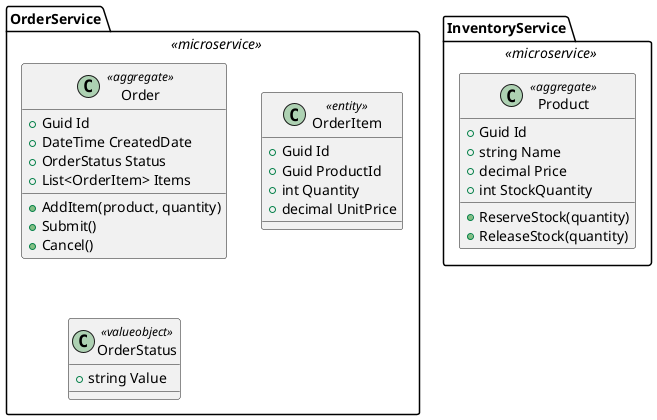

# Design 1: Basic Architecture - PlantUML to Clean Architecture Microservices

## Overview

This design proposes a straightforward approach to generating n-tier microservices from PlantUML documents. The focus is on leveraging existing parsing infrastructure while adding support for Clean Architecture patterns.

## Goals

1. Parse PlantUML package declarations as microservices
2. Generate Clean Architecture layers (Domain, Application, Infrastructure, Api)
3. Create proper project references and dependencies
4. Support basic entity and aggregate root definitions

## PlantUML Input Format



## Generated Solution Structure

```
MySolution/
├── src/
│   ├── BuildingBlocks/
│   │   ├── Messaging/
│   │   ├── Kernel/
│   │   └── Validation/
│   ├── Services/
│   │   ├── OrderService/
│   │   │   ├── OrderService.Domain/
│   │   │   │   ├── AggregateModels/
│   │   │   │   │   └── OrderAggregate/
│   │   │   │   │       ├── Order.cs
│   │   │   │   │       ├── OrderItem.cs
│   │   │   │   │       └── OrderStatus.cs
│   │   │   │   └── Events/
│   │   │   ├── OrderService.Application/
│   │   │   │   ├── Commands/
│   │   │   │   ├── Queries/
│   │   │   │   └── Behaviors/
│   │   │   ├── OrderService.Infrastructure/
│   │   │   │   ├── Data/
│   │   │   │   └── Repositories/
│   │   │   └── OrderService.Api/
│   │   │       ├── Controllers/
│   │   │       └── Program.cs
│   │   └── InventoryService/
│   │       └── ... (same structure)
│   └── MySolution.sln
└── tests/
    ├── OrderService.UnitTests/
    └── InventoryService.UnitTests/
```

## Implementation Components

### 1. PlantUML Parser Extensions

```csharp
// New parsing strategy for microservices
public class MicroservicePlantUmlParsingStrategy : IArtifactParsingStrategy<MicroserviceModel>
{
    public int GetPriority() => 100;

    public async Task<MicroserviceModel> ParseAsync(IArtifactParser parser, string value)
    {
        // Parse package with <<microservice>> stereotype
        // Extract entities, aggregates, value objects
        // Build MicroserviceModel with all components
    }
}
```

### 2. Model Enhancements

```csharp
public class MicroserviceModel
{
    public string Name { get; set; }
    public List<AggregateModel> Aggregates { get; set; }
    public List<EntityModel> Entities { get; set; }
    public List<ValueObjectModel> ValueObjects { get; set; }
    public ArchitectureStyle Architecture { get; set; } = ArchitectureStyle.CleanArchitecture;
}

public enum ArchitectureStyle
{
    CleanArchitecture,
    OnionArchitecture,
    HexagonalArchitecture,
    VerticalSlices
}
```

### 3. CLI Command

```bash
endpoint microservices-create-from-plantuml \
    --file ./microservices.puml \
    --name MySolution \
    --directory ./output \
    --architecture clean
```

## Processing Pipeline

```
┌─────────────────────┐
│   PlantUML File     │
│   (Input)           │
└──────────┬──────────┘
           │
           ▼
┌─────────────────────┐
│   PlantUML Parser   │
│   - Tokenize        │
│   - Extract packages│
│   - Parse classes   │
└──────────┬──────────┘
           │
           ▼
┌─────────────────────┐
│   Model Builder     │
│   - MicroserviceModel│
│   - AggregateModel  │
│   - EntityModel     │
└──────────┬──────────┘
           │
           ▼
┌─────────────────────┐
│   Solution Factory  │
│   - Create projects │
│   - Add references  │
│   - Configure deps  │
└──────────┬──────────┘
           │
           ▼
┌─────────────────────┐
│   Code Generator    │
│   - Domain classes  │
│   - Repositories    │
│   - Controllers     │
└──────────┬──────────┘
           │
           ▼
┌─────────────────────┐
│   Output Solution   │
│   (Generated Files) │
└─────────────────────┘
```

## Pros and Cons

### Pros
- Simple, straightforward implementation
- Leverages existing parsing infrastructure
- Clear mapping from PlantUML to code
- Extensible for additional features

### Cons
- Limited to predefined stereotypes
- No inter-service communication out of the box
- Manual configuration needed for complex scenarios
- No orchestration support

## Implementation Effort

| Component | Estimated Complexity |
|-----------|---------------------|
| Parser Extensions | Medium |
| Model Enhancements | Low |
| Solution Factory | Medium |
| Code Generation | Medium |
| CLI Integration | Low |

## See Also

- [Architecture Diagram](./architecture.puml)
- [Workflow Diagram](./workflow.drawio)
