# Design 2: Event-Driven Architecture - Message-Based Microservices

## Overview

This design extends the basic architecture to support event-driven microservices with message-based communication. It emphasizes loose coupling between services through asynchronous messaging, domain events, and integration events.

## Goals

1. Define events and commands in PlantUML
2. Generate message bus infrastructure
3. Create event handlers and command handlers
4. Support saga/choreography patterns
5. Generate integration event contracts

## Key Concepts

### Domain Events vs Integration Events

| Type | Scope | Purpose |
|------|-------|---------|
| Domain Events | Within a bounded context | Notify other aggregates of changes |
| Integration Events | Cross-service | Communicate between microservices |

## PlantUML Input Format

```plantuml
@startuml Event-Driven Microservices
!define MICROSERVICE(name) package name <<microservice>>
!define AGGREGATE(name) class name <<aggregate>>
!define DOMAIN_EVENT(name) class name <<domain-event>>
!define INTEGRATION_EVENT(name) class name <<integration-event>>
!define COMMAND(name) class name <<command>>
!define COMMAND_HANDLER(name) class name <<command-handler>>
!define EVENT_HANDLER(name) class name <<event-handler>>
!define SAGA(name) class name <<saga>>

' Message Bus Configuration
package MessageBus <<infrastructure>> {
    interface IMessageBus
    interface IEventPublisher
    interface ICommandSender
}

MICROSERVICE(OrderService) {
    AGGREGATE(Order) {
        +Guid Id
        +OrderStatus Status
        +List<OrderItem> Items
    }

    COMMAND(CreateOrderCommand) {
        +Guid CustomerId
        +List<OrderItemDto> Items
    }

    COMMAND(SubmitOrderCommand) {
        +Guid OrderId
    }

    DOMAIN_EVENT(OrderCreatedEvent) {
        +Guid OrderId
        +DateTime CreatedAt
    }

    DOMAIN_EVENT(OrderSubmittedEvent) {
        +Guid OrderId
        +Guid CustomerId
        +decimal TotalAmount
    }

    INTEGRATION_EVENT(OrderSubmittedIntegrationEvent) {
        +Guid OrderId
        +List<OrderItemDto> Items
    }

    SAGA(OrderProcessingSaga) {
        +Guid OrderId
        +SagaState State
        --
        +Handle(OrderSubmittedEvent)
        +Handle(InventoryReservedEvent)
        +Handle(PaymentCompletedEvent)
        +CompensateInventory()
        +CompensatePayment()
    }
}

MICROSERVICE(InventoryService) {
    AGGREGATE(Product) {
        +Guid Id
        +int StockQuantity
    }

    COMMAND(ReserveInventoryCommand) {
        +Guid OrderId
        +List<ReservationItem> Items
    }

    INTEGRATION_EVENT(InventoryReservedEvent) {
        +Guid OrderId
        +bool Success
    }

    INTEGRATION_EVENT(InventoryReservationFailedEvent) {
        +Guid OrderId
        +string Reason
    }
}

' Event flow
OrderSubmittedIntegrationEvent --> ReserveInventoryCommand : triggers
InventoryReservedEvent --> OrderProcessingSaga : handled by
@enduml
```



## Generated Solution Structure

```
MySolution/
├── src/
│   ├── BuildingBlocks/
│   │   ├── EventBus/
│   │   │   ├── EventBus.Abstractions/
│   │   │   │   ├── IEventBus.cs
│   │   │   │   ├── IIntegrationEventHandler.cs
│   │   │   │   └── IntegrationEvent.cs
│   │   │   ├── EventBus.RabbitMQ/
│   │   │   │   └── RabbitMQEventBus.cs
│   │   │   └── EventBus.ServiceBus/
│   │   │       └── ServiceBusEventBus.cs
│   │   ├── Messaging/
│   │   │   ├── Commands/
│   │   │   │   ├── ICommand.cs
│   │   │   │   └── ICommandHandler.cs
│   │   │   └── Events/
│   │   │       ├── IDomainEvent.cs
│   │   │       └── IDomainEventHandler.cs
│   │   └── Sagas/
│   │       ├── ISaga.cs
│   │       ├── SagaBase.cs
│   │       └── SagaOrchestrator.cs
│   ├── Services/
│   │   ├── OrderService/
│   │   │   ├── OrderService.Domain/
│   │   │   │   ├── Aggregates/
│   │   │   │   │   └── Order/
│   │   │   │   └── Events/
│   │   │   │       ├── OrderCreatedEvent.cs
│   │   │   │       └── OrderSubmittedEvent.cs
│   │   │   ├── OrderService.Application/
│   │   │   │   ├── Commands/
│   │   │   │   │   ├── CreateOrderCommand.cs
│   │   │   │   │   └── CreateOrderCommandHandler.cs
│   │   │   │   ├── IntegrationEvents/
│   │   │   │   │   ├── Events/
│   │   │   │   │   │   └── OrderSubmittedIntegrationEvent.cs
│   │   │   │   │   └── Handlers/
│   │   │   │   │       └── InventoryReservedEventHandler.cs
│   │   │   │   └── Sagas/
│   │   │   │       └── OrderProcessingSaga.cs
│   │   │   ├── OrderService.Infrastructure/
│   │   │   └── OrderService.Api/
│   │   └── InventoryService/
│   │       └── ... (similar structure)
│   └── Contracts/
│       └── IntegrationEvents/
│           ├── OrderSubmittedIntegrationEvent.cs
│           ├── InventoryReservedEvent.cs
│           └── InventoryReservationFailedEvent.cs
└── docker-compose.yml (with RabbitMQ/ServiceBus)
```

## Implementation Components

### 1. Event Bus Abstraction

```csharp
public interface IEventBus
{
    Task PublishAsync<TEvent>(TEvent @event, CancellationToken cancellationToken = default)
        where TEvent : IntegrationEvent;

    void Subscribe<TEvent, THandler>()
        where TEvent : IntegrationEvent
        where THandler : IIntegrationEventHandler<TEvent>;
}

public abstract class IntegrationEvent
{
    public Guid Id { get; } = Guid.NewGuid();
    public DateTime CreationDate { get; } = DateTime.UtcNow;
    public string CorrelationId { get; set; }
}
```

### 2. Saga Base Implementation

```csharp
public abstract class SagaBase<TState> : ISaga
    where TState : class, new()
{
    public Guid Id { get; protected set; }
    public TState State { get; protected set; }
    public SagaStatus Status { get; protected set; }

    protected abstract Task<bool> CompensateAsync();

    public async Task HandleAsync<TEvent>(TEvent @event)
    {
        // State machine logic
    }
}
```

### 3. PlantUML Parser Extensions

```csharp
public class EventPlantUmlParsingStrategy : IArtifactParsingStrategy<IntegrationEventModel>
{
    private readonly Regex _eventPattern = new(@"class\s+(\w+)\s+<<integration-event>>");

    public async Task<IntegrationEventModel> ParseAsync(IArtifactParser parser, string value)
    {
        // Parse integration event with properties
    }
}

public class SagaPlantUmlParsingStrategy : IArtifactParsingStrategy<SagaModel>
{
    private readonly Regex _sagaPattern = new(@"class\s+(\w+)\s+<<saga>>");

    public async Task<SagaModel> ParseAsync(IArtifactParser parser, string value)
    {
        // Parse saga with handlers and compensations
    }
}
```

## CLI Command

```bash
endpoint event-driven-microservices-create-from-plantuml \
    --file ./microservices.puml \
    --name MySolution \
    --directory ./output \
    --message-bus rabbitmq \
    --saga-storage mongodb
```

### Command Options

| Option | Description | Default |
|--------|-------------|---------|
| `--file` | Path to PlantUML file | Required |
| `--name` | Solution name | Required |
| `--directory` | Output directory | Current dir |
| `--message-bus` | Message bus type (rabbitmq, servicebus, inmemory) | rabbitmq |
| `--saga-storage` | Saga state storage (mongodb, sql, redis) | mongodb |
| `--generate-contracts` | Generate shared contracts project | true |

## Event Flow Architecture

```
┌─────────────────┐     ┌─────────────────┐     ┌─────────────────┐
│  Order Service  │     │  Message Bus    │     │Inventory Service│
│                 │     │  (RabbitMQ)     │     │                 │
│  ┌───────────┐  │     │                 │     │  ┌───────────┐  │
│  │  Order    │  │     │  ┌───────────┐  │     │  │  Product  │  │
│  │ Aggregate │──┼────▶│  │ Exchange  │──┼────▶│  │ Aggregate │  │
│  └───────────┘  │     │  └───────────┘  │     │  └───────────┘  │
│        │        │     │        │        │     │        │        │
│        ▼        │     │        ▼        │     │        ▼        │
│  ┌───────────┐  │     │  ┌───────────┐  │     │  ┌───────────┐  │
│  │  Domain   │  │     │  │   Queue   │  │     │  │Integration│  │
│  │  Events   │  │     │  │           │  │     │  │  Handler  │  │
│  └───────────┘  │     │  └───────────┘  │     │  └───────────┘  │
│        │        │     │                 │     │        │        │
│        ▼        │     │                 │     │        ▼        │
│  ┌───────────┐  │     │                 │     │  ┌───────────┐  │
│  │Integration│  │     │                 │     │  │  Command  │  │
│  │  Events   │──┼────▶│                 │     │  │  Handler  │  │
│  └───────────┘  │     │                 │     │  └───────────┘  │
└─────────────────┘     └─────────────────┘     └─────────────────┘
```

## Saga Orchestration Pattern

```
                    ┌─────────────────────────────┐
                    │    Order Processing Saga     │
                    │         (Orchestrator)       │
                    └──────────────┬──────────────┘
                                   │
        ┌──────────────────────────┼──────────────────────────┐
        │                          │                          │
        ▼                          ▼                          ▼
┌───────────────┐        ┌───────────────┐        ┌───────────────┐
│    Step 1     │        │    Step 2     │        │    Step 3     │
│   Reserve     │───────▶│   Process     │───────▶│   Ship        │
│   Inventory   │        │   Payment     │        │   Order       │
└───────────────┘        └───────────────┘        └───────────────┘
        │                          │                          │
        │ Failure                  │ Failure                  │ Failure
        ▼                          ▼                          ▼
┌───────────────┐        ┌───────────────┐        ┌───────────────┐
│  Compensate:  │◀───────│  Compensate:  │◀───────│  Compensate:  │
│  Release      │        │  Refund       │        │  Cancel       │
│  Inventory    │        │  Payment      │        │  Shipment     │
└───────────────┘        └───────────────┘        └───────────────┘
```

## Pros and Cons

### Pros
- Loose coupling between services
- Resilient to failures (retry, compensation)
- Scalable event processing
- Clear audit trail through events
- Supports complex workflows via sagas

### Cons
- Increased complexity
- Eventual consistency challenges
- Debugging distributed transactions is harder
- Requires message broker infrastructure
- Learning curve for saga patterns

## Implementation Effort

| Component | Estimated Complexity |
|-----------|---------------------|
| Event Bus Abstraction | Medium |
| Integration Event Parsing | Medium |
| Saga Parser & Generator | High |
| Event Handler Generation | Medium |
| Message Broker Setup | Medium |
| Contract Project Generation | Low |

## See Also

- [Architecture Diagram](./architecture.puml)
- [Message Flow Diagram](./message-flow.drawio)
- [Example Input](./example-input.puml)
