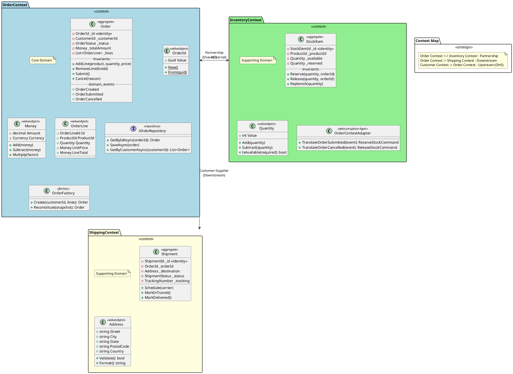

# Design 4: DDD-Focused - Bounded Contexts and Strategic Design

## Overview

This design emphasizes Domain-Driven Design principles, using PlantUML to define bounded contexts, aggregates, entities, value objects, domain services, and context mappings. The generator produces microservices that strictly follow DDD tactical and strategic patterns.

## Goals

1. Parse bounded contexts as microservice boundaries
2. Generate proper aggregate roots with invariants
3. Create value objects with equality semantics
4. Implement domain events for aggregate communication
5. Define context mappings (ACL, OHS, Partnership)
6. Generate anti-corruption layers for integration

## DDD Concepts Mapping

| DDD Concept | PlantUML Representation | Generated Artifact |
|-------------|------------------------|-------------------|
| Bounded Context | Package with `<<context>>` | Microservice |
| Aggregate Root | Class with `<<aggregate>>` | Entity with root behavior |
| Entity | Class with `<<entity>>` | Entity with identity |
| Value Object | Class with `<<valueobject>>` | Immutable record |
| Domain Service | Class with `<<service>>` | Stateless service |
| Domain Event | Class with `<<domain-event>>` | Event class |
| Repository | Interface with `<<repository>>` | Repository interface |
| Factory | Class with `<<factory>>` | Factory class |

## PlantUML Input Format



## Generated Solution Structure

```
MySolution/
├── src/
│   ├── SharedKernel/                          # Shared DDD building blocks
│   │   ├── Abstractions/
│   │   │   ├── IAggregateRoot.cs
│   │   │   ├── IEntity.cs
│   │   │   ├── ValueObject.cs
│   │   │   ├── IDomainEvent.cs
│   │   │   └── IRepository.cs
│   │   └── Primitives/
│   │       ├── EntityId.cs
│   │       └── AuditableEntity.cs
│   ├── Contexts/
│   │   ├── OrderContext/                      # Bounded Context
│   │   │   ├── OrderContext.Domain/
│   │   │   │   ├── Aggregates/
│   │   │   │   │   └── Order/
│   │   │   │   │       ├── Order.cs           # Aggregate Root
│   │   │   │   │       ├── OrderLine.cs       # Entity
│   │   │   │   │       └── OrderFactory.cs    # Factory
│   │   │   │   ├── ValueObjects/
│   │   │   │   │   ├── OrderId.cs
│   │   │   │   │   ├── Money.cs
│   │   │   │   │   └── Currency.cs
│   │   │   │   ├── Events/
│   │   │   │   │   ├── OrderCreated.cs
│   │   │   │   │   ├── OrderSubmitted.cs
│   │   │   │   │   └── OrderCancelled.cs
│   │   │   │   ├── Repositories/
│   │   │   │   │   └── IOrderRepository.cs
│   │   │   │   └── Services/
│   │   │   │       └── OrderDomainService.cs
│   │   │   ├── OrderContext.Application/
│   │   │   │   ├── Commands/
│   │   │   │   ├── Queries/
│   │   │   │   └── DomainEventHandlers/
│   │   │   ├── OrderContext.Infrastructure/
│   │   │   │   ├── Persistence/
│   │   │   │   │   ├── OrderRepository.cs
│   │   │   │   │   └── OrderDbContext.cs
│   │   │   │   └── Outbox/
│   │   │   │       └── OutboxProcessor.cs
│   │   │   └── OrderContext.Api/
│   │   ├── InventoryContext/
│   │   │   ├── InventoryContext.Domain/
│   │   │   ├── InventoryContext.Application/
│   │   │   ├── InventoryContext.Infrastructure/
│   │   │   │   └── AntiCorruptionLayer/
│   │   │   │       └── OrderContextAdapter.cs  # ACL
│   │   │   └── InventoryContext.Api/
│   │   └── ShippingContext/
│   │       └── ...
└── tests/
    ├── OrderContext.Domain.Tests/
    └── ...
```

## Generated Code Examples

### Aggregate Root

```csharp
// OrderContext.Domain/Aggregates/Order/Order.cs
public sealed class Order : AggregateRoot<OrderId>
{
    private readonly List<OrderLine> _lines = new();
    private readonly List<IDomainEvent> _domainEvents = new();

    public CustomerId CustomerId { get; private set; }
    public OrderStatus Status { get; private set; }
    public Money TotalAmount => CalculateTotal();
    public IReadOnlyCollection<OrderLine> Lines => _lines.AsReadOnly();
    public IReadOnlyCollection<IDomainEvent> DomainEvents => _domainEvents.AsReadOnly();

    private Order() { } // For EF Core

    private Order(OrderId id, CustomerId customerId) : base(id)
    {
        CustomerId = customerId;
        Status = OrderStatus.Draft;
        AddDomainEvent(new OrderCreated(Id, CustomerId, DateTime.UtcNow));
    }

    public static Order Create(CustomerId customerId)
    {
        Guard.Against.Null(customerId, nameof(customerId));
        return new Order(OrderId.New(), customerId);
    }

    public void AddLine(ProductId productId, Quantity quantity, Money unitPrice)
    {
        Guard.Against.Null(productId, nameof(productId));
        Guard.Against.NegativeOrZero(quantity.Value, nameof(quantity));

        EnsureNotSubmitted();

        var existingLine = _lines.FirstOrDefault(l => l.ProductId == productId);
        if (existingLine != null)
        {
            existingLine.IncreaseQuantity(quantity);
        }
        else
        {
            _lines.Add(new OrderLine(OrderLineId.New(), productId, quantity, unitPrice));
        }
    }

    public void Submit()
    {
        EnsureHasLines();
        EnsureNotSubmitted();

        Status = OrderStatus.Submitted;
        AddDomainEvent(new OrderSubmitted(Id, CustomerId, TotalAmount, Lines.ToList()));
    }

    public void Cancel(string reason)
    {
        Guard.Against.NullOrEmpty(reason, nameof(reason));
        EnsureNotCancelled();

        Status = OrderStatus.Cancelled;
        AddDomainEvent(new OrderCancelled(Id, reason));
    }

    private void EnsureNotSubmitted()
    {
        if (Status != OrderStatus.Draft)
            throw new DomainException("Order has already been submitted");
    }

    private void EnsureHasLines()
    {
        if (!_lines.Any())
            throw new DomainException("Order must have at least one line item");
    }

    private Money CalculateTotal() => _lines.Aggregate(Money.Zero, (sum, line) => sum + line.LineTotal);

    private void AddDomainEvent(IDomainEvent domainEvent) => _domainEvents.Add(domainEvent);

    public void ClearDomainEvents() => _domainEvents.Clear();
}
```

### Value Object

```csharp
// OrderContext.Domain/ValueObjects/Money.cs
public sealed class Money : ValueObject
{
    public decimal Amount { get; }
    public Currency Currency { get; }

    public static Money Zero => new(0, Currency.USD);

    private Money(decimal amount, Currency currency)
    {
        Amount = amount;
        Currency = currency;
    }

    public static Money Create(decimal amount, Currency currency)
    {
        Guard.Against.Negative(amount, nameof(amount));
        return new Money(amount, currency);
    }

    public Money Add(Money other)
    {
        EnsureSameCurrency(other);
        return new Money(Amount + other.Amount, Currency);
    }

    public Money Subtract(Money other)
    {
        EnsureSameCurrency(other);
        var result = Amount - other.Amount;
        Guard.Against.Negative(result, "Result cannot be negative");
        return new Money(result, Currency);
    }

    public Money Multiply(decimal factor)
    {
        Guard.Against.Negative(factor, nameof(factor));
        return new Money(Amount * factor, Currency);
    }

    public static Money operator +(Money a, Money b) => a.Add(b);
    public static Money operator -(Money a, Money b) => a.Subtract(b);
    public static Money operator *(Money a, decimal factor) => a.Multiply(factor);

    private void EnsureSameCurrency(Money other)
    {
        if (Currency != other.Currency)
            throw new DomainException("Cannot operate on money with different currencies");
    }

    protected override IEnumerable<object> GetEqualityComponents()
    {
        yield return Amount;
        yield return Currency;
    }
}
```

### Anti-Corruption Layer

```csharp
// InventoryContext.Infrastructure/AntiCorruptionLayer/OrderContextAdapter.cs
public class OrderContextAdapter : IOrderContextAdapter
{
    private readonly IMediator _mediator;

    public OrderContextAdapter(IMediator mediator)
    {
        _mediator = mediator;
    }

    public async Task HandleOrderSubmittedAsync(OrderSubmittedIntegrationEvent externalEvent)
    {
        // Translate external event to internal command
        // This protects our bounded context from external model changes
        var command = new ReserveStockCommand
        {
            CorrelationId = externalEvent.OrderId.ToString(),
            Items = externalEvent.Items.Select(item => new ReservationItem
            {
                ProductId = TranslateProductId(item.ProductId),
                Quantity = item.Quantity
            }).ToList()
        };

        await _mediator.Send(command);
    }

    public async Task HandleOrderCancelledAsync(OrderCancelledIntegrationEvent externalEvent)
    {
        var command = new ReleaseStockCommand
        {
            CorrelationId = externalEvent.OrderId.ToString()
        };

        await _mediator.Send(command);
    }

    private StockItemId TranslateProductId(Guid externalProductId)
    {
        // Map external product ID to internal stock item ID
        // This translation protects our model from external changes
        return StockItemId.From(externalProductId);
    }
}
```

## CLI Command

```bash
endpoint ddd-microservices-create-from-plantuml \
    --file ./bounded-contexts.puml \
    --name MySolution \
    --directory ./output \
    --shared-kernel true \
    --outbox-pattern true \
    --generate-acl true
```

### Command Options

| Option | Description | Default |
|--------|-------------|---------|
| `--file` | Path to PlantUML file | Required |
| `--name` | Solution name | Required |
| `--directory` | Output directory | Current dir |
| `--shared-kernel` | Generate shared kernel project | true |
| `--outbox-pattern` | Use outbox for domain events | true |
| `--generate-acl` | Generate anti-corruption layers | true |
| `--aggregate-snapshots` | Enable aggregate snapshots | false |
| `--event-sourcing` | Use event sourcing | false |

## Context Mapping Patterns

### 1. Partnership

Both contexts evolve together. Generates shared interfaces and contracts.

```plantuml
OrderContext --> InventoryContext : Partnership
```

### 2. Customer-Supplier (Upstream/Downstream)

Upstream context provides, downstream consumes.

```plantuml
OrderContext --> ShippingContext : Customer-Supplier
```

### 3. Anti-Corruption Layer

Translates between external and internal models.

```plantuml
InventoryContext ..> ExternalCatalog : ACL
```

### 4. Open Host Service

Exposes a well-defined protocol for consumers.

```plantuml
CustomerContext -|> OrderContext : OHS
```

### 5. Shared Kernel

Common code shared between contexts.

```plantuml
OrderContext -- InventoryContext : <<shared-kernel>>
```

## Implementation Components

### 1. Bounded Context Parser

```csharp
public class BoundedContextPlantUmlParsingStrategy : IArtifactParsingStrategy<BoundedContextModel>
{
    public async Task<BoundedContextModel> ParseAsync(IArtifactParser parser, string value)
    {
        // Parse package with <<context>> stereotype
        // Extract aggregates, entities, value objects
        // Identify context mappings from relationships
    }
}
```

### 2. Aggregate Root Generator

```csharp
public class AggregateRootGenerationStrategy : IArtifactGenerationStrategy<AggregateModel>
{
    public async Task GenerateAsync(AggregateModel model, GenerationContext context)
    {
        // Generate aggregate class with:
        // - Private constructor for EF Core
        // - Factory methods
        // - Domain event tracking
        // - Invariant enforcement
        // - Value object properties
    }
}
```

### 3. Context Mapping Generator

```csharp
public class ContextMappingGenerationStrategy : IArtifactGenerationStrategy<ContextMappingModel>
{
    public async Task GenerateAsync(ContextMappingModel model, GenerationContext context)
    {
        switch (model.MappingType)
        {
            case MappingType.AntiCorruptionLayer:
                await GenerateAclAsync(model);
                break;
            case MappingType.OpenHostService:
                await GenerateOhsAsync(model);
                break;
            case MappingType.SharedKernel:
                await GenerateSharedKernelAsync(model);
                break;
        }
    }
}
```

## Pros and Cons

### Pros
- Strong domain model with invariants
- Clear bounded context boundaries
- Proper value object semantics
- Domain event-driven communication
- Anti-corruption layer protection
- Matches DDD patterns precisely

### Cons
- Higher complexity for simple domains
- Requires DDD knowledge
- More boilerplate code
- Steep learning curve
- Overkill for CRUD applications

## Implementation Effort

| Component | Estimated Complexity |
|-----------|---------------------|
| Bounded Context Parser | Medium |
| Aggregate Generator | High |
| Value Object Generator | Medium |
| Context Mapping Parser | High |
| ACL Generator | Medium |
| Shared Kernel Generator | Low |

## See Also

- [Context Map Diagram](./context-map.puml)
- [Tactical Design Diagram](./tactical-design.drawio)
- [Example Input](./example-input.puml)
