# Design 5: Full Stack - End-to-End Solution Generation

## Overview

This design provides a comprehensive approach to generating complete full-stack solutions from PlantUML documents. It generates both backend microservices and frontend applications (Angular, React, or Lit), including API clients, state management, and UI components.

## Goals

1. Generate backend microservices with APIs
2. Create frontend applications (Angular/React/Lit)
3. Generate TypeScript API clients automatically
4. Create UI components for entities
5. Implement state management (NgRx, Redux, etc.)
6. Generate end-to-end tests

## Full Stack Mapping

| Backend Concept | Frontend Artifact |
|-----------------|-------------------|
| Entity/Aggregate | TypeScript interface |
| API Controller | API client service |
| Command | Mutation/Action |
| Query | Query/Selector |
| Domain Event | Real-time subscription |
| Validation Rules | Form validation |

## PlantUML Input Format

```plantuml
@startuml Full Stack Solution
!define MICROSERVICE(name) package name <<microservice>>
!define FRONTEND(name) package name <<frontend>>
!define AGGREGATE(name) class name <<aggregate>>
!define COMPONENT(name) class name <<component>>
!define PAGE(name) class name <<page>>
!define FORM(name) class name <<form>>
!define LIST(name) class name <<list>>
!define DETAIL(name) class name <<detail>>
!define STORE(name) class name <<store>>
!define API_CLIENT(name) class name <<api-client>>

' Backend Microservices
MICROSERVICE(OrderService) {
    AGGREGATE(Order) {
        +Guid Id
        +string OrderNumber
        +CustomerId CustomerId
        +OrderStatus Status
        +List<OrderLine> Lines
        +decimal TotalAmount
        +DateTime CreatedAt
    }

    note "API Endpoints:\nGET /api/orders\nGET /api/orders/{id}\nPOST /api/orders\nPUT /api/orders/{id}\nDELETE /api/orders/{id}" as OrderAPI
}

' Frontend Application
FRONTEND(OrderApp) <<angular>> {
    note "Framework: Angular 17+\nState: NgRx Signals" as FrontendNote

    STORE(OrderStore) {
        +Signal<Order[]> orders
        +Signal<Order> selectedOrder
        +Signal<boolean> loading
        +Signal<string> error
        --
        +loadOrders()
        +loadOrder(id)
        +createOrder(order)
        +updateOrder(order)
        +deleteOrder(id)
    }

    PAGE(OrderListPage) {
        +OrderStore store
        --
        +onCreateClick()
        +onEditClick(order)
        +onDeleteClick(order)
    }

    PAGE(OrderDetailPage) {
        +OrderStore store
        +ActivatedRoute route
        --
        +onBackClick()
        +onEditClick()
    }

    COMPONENT(OrderTable) <<list>> {
        +@Input() orders: Order[]
        +@Output() select: EventEmitter<Order>
        +@Output() delete: EventEmitter<Order>
    }

    FORM(OrderForm) {
        +@Input() order: Order
        +@Output() submit: EventEmitter<Order>
        +@Output() cancel: EventEmitter<void>
        --
        +FormGroup form
        +onSubmit()
    }

    API_CLIENT(OrderApiClient) {
        +getOrders(): Observable<Order[]>
        +getOrder(id): Observable<Order>
        +createOrder(order): Observable<Order>
        +updateOrder(order): Observable<Order>
        +deleteOrder(id): Observable<void>
    }
}

OrderApp --> OrderService : consumes API
@enduml
```



## Generated Solution Structure

```
MySolution/
├── src/
│   ├── backend/
│   │   ├── BuildingBlocks/
│   │   │   └── ...
│   │   ├── Services/
│   │   │   ├── OrderService/
│   │   │   │   ├── OrderService.Domain/
│   │   │   │   ├── OrderService.Application/
│   │   │   │   ├── OrderService.Infrastructure/
│   │   │   │   └── OrderService.Api/
│   │   │   │       ├── Controllers/
│   │   │   │       │   └── OrdersController.cs
│   │   │   │       └── Program.cs
│   │   │   └── InventoryService/
│   │   └── Gateway/
│   ├── frontend/
│   │   ├── apps/
│   │   │   ├── order-app/                    # Angular App
│   │   │   │   ├── src/
│   │   │   │   │   ├── app/
│   │   │   │   │   │   ├── core/
│   │   │   │   │   │   │   ├── api/
│   │   │   │   │   │   │   │   ├── order-api.client.ts
│   │   │   │   │   │   │   │   └── models/
│   │   │   │   │   │   │   │       ├── order.model.ts
│   │   │   │   │   │   │   │       └── order-line.model.ts
│   │   │   │   │   │   │   └── store/
│   │   │   │   │   │   │       ├── order.store.ts
│   │   │   │   │   │   │       └── order.effects.ts
│   │   │   │   │   │   ├── features/
│   │   │   │   │   │   │   └── orders/
│   │   │   │   │   │   │       ├── pages/
│   │   │   │   │   │   │       │   ├── order-list/
│   │   │   │   │   │   │       │   │   └── order-list.component.ts
│   │   │   │   │   │   │       │   └── order-detail/
│   │   │   │   │   │   │       │       └── order-detail.component.ts
│   │   │   │   │   │   │       └── components/
│   │   │   │   │   │   │           ├── order-table/
│   │   │   │   │   │   │           └── order-form/
│   │   │   │   │   │   └── shared/
│   │   │   │   │   └── environments/
│   │   │   │   └── angular.json
│   │   │   └── admin-app/                    # React App
│   │   │       ├── src/
│   │   │       │   ├── api/
│   │   │       │   ├── store/
│   │   │       │   ├── pages/
│   │   │       │   └── components/
│   │   │       └── package.json
│   │   └── libs/
│   │       └── shared-models/               # Shared TypeScript types
│   │           └── src/
│   │               ├── order.ts
│   │               └── index.ts
│   └── e2e/
│       ├── playwright/
│       └── cypress/
├── docker-compose.yml
└── README.md
```

## Generated Code Examples

### Backend API Controller

```csharp
// OrderService.Api/Controllers/OrdersController.cs
[ApiController]
[Route("api/[controller]")]
public class OrdersController : ControllerBase
{
    private readonly IMediator _mediator;

    public OrdersController(IMediator mediator)
    {
        _mediator = mediator;
    }

    [HttpGet]
    [ProducesResponseType(typeof(List<OrderDto>), StatusCodes.Status200OK)]
    public async Task<IActionResult> GetOrders([FromQuery] GetOrdersQuery query)
    {
        var result = await _mediator.Send(query);
        return Ok(result);
    }

    [HttpGet("{id}")]
    [ProducesResponseType(typeof(OrderDto), StatusCodes.Status200OK)]
    [ProducesResponseType(StatusCodes.Status404NotFound)]
    public async Task<IActionResult> GetOrder(Guid id)
    {
        var result = await _mediator.Send(new GetOrderByIdQuery(id));
        return result is null ? NotFound() : Ok(result);
    }

    [HttpPost]
    [ProducesResponseType(typeof(OrderDto), StatusCodes.Status201Created)]
    [ProducesResponseType(typeof(ValidationProblemDetails), StatusCodes.Status400BadRequest)]
    public async Task<IActionResult> CreateOrder([FromBody] CreateOrderCommand command)
    {
        var result = await _mediator.Send(command);
        return CreatedAtAction(nameof(GetOrder), new { id = result.Id }, result);
    }

    [HttpPut("{id}")]
    [ProducesResponseType(typeof(OrderDto), StatusCodes.Status200OK)]
    [ProducesResponseType(StatusCodes.Status404NotFound)]
    public async Task<IActionResult> UpdateOrder(Guid id, [FromBody] UpdateOrderCommand command)
    {
        command.Id = id;
        var result = await _mediator.Send(command);
        return Ok(result);
    }

    [HttpDelete("{id}")]
    [ProducesResponseType(StatusCodes.Status204NoContent)]
    public async Task<IActionResult> DeleteOrder(Guid id)
    {
        await _mediator.Send(new DeleteOrderCommand(id));
        return NoContent();
    }
}
```

### Frontend TypeScript Model

```typescript
// frontend/libs/shared-models/src/order.ts
export interface Order {
  id: string;
  orderNumber: string;
  customerId: string;
  status: OrderStatus;
  lines: OrderLine[];
  totalAmount: number;
  createdAt: Date;
  updatedAt?: Date;
}

export interface OrderLine {
  id: string;
  productId: string;
  productName: string;
  quantity: number;
  unitPrice: number;
  lineTotal: number;
}

export enum OrderStatus {
  Draft = 'Draft',
  Submitted = 'Submitted',
  Processing = 'Processing',
  Shipped = 'Shipped',
  Delivered = 'Delivered',
  Cancelled = 'Cancelled'
}

export interface CreateOrderRequest {
  customerId: string;
  lines: CreateOrderLineRequest[];
}

export interface CreateOrderLineRequest {
  productId: string;
  quantity: number;
}
```

### Angular API Client

```typescript
// frontend/apps/order-app/src/app/core/api/order-api.client.ts
import { Injectable, inject } from '@angular/core';
import { HttpClient } from '@angular/common/http';
import { Observable } from 'rxjs';
import { Order, CreateOrderRequest } from '@myapp/shared-models';
import { environment } from '../../../environments/environment';

@Injectable({ providedIn: 'root' })
export class OrderApiClient {
  private readonly http = inject(HttpClient);
  private readonly baseUrl = `${environment.apiUrl}/api/orders`;

  getOrders(): Observable<Order[]> {
    return this.http.get<Order[]>(this.baseUrl);
  }

  getOrder(id: string): Observable<Order> {
    return this.http.get<Order>(`${this.baseUrl}/${id}`);
  }

  createOrder(request: CreateOrderRequest): Observable<Order> {
    return this.http.post<Order>(this.baseUrl, request);
  }

  updateOrder(id: string, request: Partial<Order>): Observable<Order> {
    return this.http.put<Order>(`${this.baseUrl}/${id}`, request);
  }

  deleteOrder(id: string): Observable<void> {
    return this.http.delete<void>(`${this.baseUrl}/${id}`);
  }
}
```

### Angular Signal Store

```typescript
// frontend/apps/order-app/src/app/core/store/order.store.ts
import { Injectable, computed, inject, signal } from '@angular/core';
import { Order } from '@myapp/shared-models';
import { OrderApiClient } from '../api/order-api.client';
import { firstValueFrom } from 'rxjs';

interface OrderState {
  orders: Order[];
  selectedOrder: Order | null;
  loading: boolean;
  error: string | null;
}

@Injectable({ providedIn: 'root' })
export class OrderStore {
  private readonly api = inject(OrderApiClient);

  // State
  private readonly state = signal<OrderState>({
    orders: [],
    selectedOrder: null,
    loading: false,
    error: null
  });

  // Selectors
  readonly orders = computed(() => this.state().orders);
  readonly selectedOrder = computed(() => this.state().selectedOrder);
  readonly loading = computed(() => this.state().loading);
  readonly error = computed(() => this.state().error);
  readonly orderCount = computed(() => this.state().orders.length);

  // Actions
  async loadOrders(): Promise<void> {
    this.state.update(s => ({ ...s, loading: true, error: null }));
    try {
      const orders = await firstValueFrom(this.api.getOrders());
      this.state.update(s => ({ ...s, orders, loading: false }));
    } catch (error) {
      this.state.update(s => ({
        ...s,
        loading: false,
        error: 'Failed to load orders'
      }));
    }
  }

  async loadOrder(id: string): Promise<void> {
    this.state.update(s => ({ ...s, loading: true, error: null }));
    try {
      const order = await firstValueFrom(this.api.getOrder(id));
      this.state.update(s => ({ ...s, selectedOrder: order, loading: false }));
    } catch (error) {
      this.state.update(s => ({
        ...s,
        loading: false,
        error: 'Failed to load order'
      }));
    }
  }

  async createOrder(request: CreateOrderRequest): Promise<Order> {
    this.state.update(s => ({ ...s, loading: true, error: null }));
    try {
      const order = await firstValueFrom(this.api.createOrder(request));
      this.state.update(s => ({
        ...s,
        orders: [...s.orders, order],
        loading: false
      }));
      return order;
    } catch (error) {
      this.state.update(s => ({
        ...s,
        loading: false,
        error: 'Failed to create order'
      }));
      throw error;
    }
  }

  async deleteOrder(id: string): Promise<void> {
    this.state.update(s => ({ ...s, loading: true, error: null }));
    try {
      await firstValueFrom(this.api.deleteOrder(id));
      this.state.update(s => ({
        ...s,
        orders: s.orders.filter(o => o.id !== id),
        loading: false
      }));
    } catch (error) {
      this.state.update(s => ({
        ...s,
        loading: false,
        error: 'Failed to delete order'
      }));
    }
  }
}
```

### Angular Component

```typescript
// frontend/apps/order-app/src/app/features/orders/pages/order-list/order-list.component.ts
import { Component, OnInit, inject } from '@angular/core';
import { CommonModule } from '@angular/common';
import { RouterModule } from '@angular/router';
import { OrderStore } from '../../../../core/store/order.store';
import { OrderTableComponent } from '../../components/order-table/order-table.component';
import { Order } from '@myapp/shared-models';

@Component({
  selector: 'app-order-list',
  standalone: true,
  imports: [CommonModule, RouterModule, OrderTableComponent],
  template: `
    <div class="order-list-page">
      <header class="page-header">
        <h1>Orders</h1>
        <button routerLink="new" class="btn-primary">Create Order</button>
      </header>

      @if (store.loading()) {
        <div class="loading">Loading orders...</div>
      }

      @if (store.error()) {
        <div class="error">{{ store.error() }}</div>
      }

      <app-order-table
        [orders]="store.orders()"
        (select)="onOrderSelect($event)"
        (delete)="onOrderDelete($event)"
      />
    </div>
  `,
  styles: [`
    .order-list-page { padding: 1rem; }
    .page-header { display: flex; justify-content: space-between; align-items: center; }
    .btn-primary { background: #1976d2; color: white; padding: 0.5rem 1rem; border: none; border-radius: 4px; cursor: pointer; }
    .loading, .error { padding: 1rem; text-align: center; }
    .error { color: #d32f2f; }
  `]
})
export class OrderListComponent implements OnInit {
  readonly store = inject(OrderStore);

  ngOnInit(): void {
    this.store.loadOrders();
  }

  onOrderSelect(order: Order): void {
    // Navigate to detail page
  }

  async onOrderDelete(order: Order): Promise<void> {
    if (confirm(`Delete order ${order.orderNumber}?`)) {
      await this.store.deleteOrder(order.id);
    }
  }
}
```

## CLI Command

```bash
endpoint fullstack-create-from-plantuml \
    --file ./fullstack.puml \
    --name MySolution \
    --directory ./output \
    --frontend angular \
    --backend aspire \
    --api-style rest \
    --generate-tests true
```

### Command Options

| Option | Description | Default |
|--------|-------------|---------|
| `--file` | Path to PlantUML file | Required |
| `--name` | Solution name | Required |
| `--directory` | Output directory | Current dir |
| `--frontend` | Frontend framework (angular, react, lit) | angular |
| `--backend` | Backend style (aspire, docker, kubernetes) | aspire |
| `--api-style` | API style (rest, graphql, grpc) | rest |
| `--generate-tests` | Generate e2e tests | true |
| `--ui-library` | UI component library | material |
| `--state-management` | State library (ngrx, signals, redux) | signals |

## Frontend Framework Support

### Angular (Default)

- Standalone components (Angular 17+)
- Signal-based state management
- Material Design components
- Lazy-loaded feature modules

### React

- Functional components with hooks
- Redux Toolkit or Zustand
- React Query for data fetching
- Tailwind CSS or Material UI

### Lit (Web Components)

- Custom elements
- Reactive properties
- Shadow DOM encapsulation
- Framework-agnostic

## Implementation Components

### 1. Frontend Parser

```csharp
public class FrontendPlantUmlParsingStrategy : IArtifactParsingStrategy<FrontendAppModel>
{
    public async Task<FrontendAppModel> ParseAsync(IArtifactParser parser, string value)
    {
        // Parse frontend package with framework stereotype
        // Extract pages, components, stores, API clients
    }
}
```

### 2. API Client Generator

```csharp
public class ApiClientGenerationStrategy : IArtifactGenerationStrategy<ApiClientModel>
{
    public async Task GenerateAsync(ApiClientModel model, GenerationContext context)
    {
        // Generate TypeScript API client from OpenAPI spec
        // Create strongly-typed methods for each endpoint
    }
}
```

### 3. Component Generator

```csharp
public class AngularComponentGenerationStrategy : IArtifactGenerationStrategy<ComponentModel>
{
    public async Task GenerateAsync(ComponentModel model, GenerationContext context)
    {
        // Generate Angular standalone component
        // Create template, styles, and TypeScript
    }
}
```

## API Contract Synchronization

```
┌─────────────────┐     ┌─────────────────┐     ┌─────────────────┐
│   Backend API   │     │   OpenAPI Spec  │     │  Frontend App   │
│                 │     │                 │     │                 │
│  Controllers    │────▶│   swagger.json  │────▶│  API Clients    │
│  DTOs           │     │                 │     │  TypeScript     │
│  Validation     │     │                 │     │  Models         │
└─────────────────┘     └─────────────────┘     └─────────────────┘
        │                                                │
        │           ┌─────────────────┐                  │
        └──────────▶│  Shared Types   │◀─────────────────┘
                    │  (Generated)    │
                    └─────────────────┘
```

## Pros and Cons

### Pros
- Complete solution from single source
- Type-safe API contracts
- Consistent patterns across stack
- Rapid prototyping
- Reduced manual boilerplate

### Cons
- Complex generation logic
- Framework-specific templates
- Maintenance of multiple generators
- May not fit all UI requirements
- Learning curve for customization

## Implementation Effort

| Component | Estimated Complexity |
|-----------|---------------------|
| Frontend Parser | Medium |
| Angular Generator | High |
| React Generator | High |
| Lit Generator | Medium |
| API Client Generator | Medium |
| State Management Generator | Medium |
| E2E Test Generator | Medium |

## See Also

- [Architecture Diagram](./architecture.puml)
- [Component Hierarchy](./component-hierarchy.drawio)
- [Example Input](./example-input.puml)
