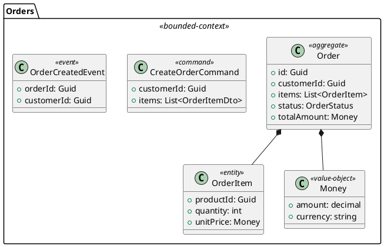

# PlantUML Solution Generator - Design Documentation

## Overview

This directory contains comprehensive design documentation for implementing the **"Create Solution from PlantUML"** feature in Endpoint.cli. This feature enables developers to generate complete n-tier .NET solutions from PlantUML domain diagrams.

## Quick Links

- [Roadmap](./roadmap/ROADMAP.md) - Implementation phases and milestones
- [Estimates](./roadmap/ESTIMATES.md) - Effort estimates and team scenarios

## Designs

### Core Designs

| Design | Description | Document |
|--------|-------------|----------|
| **Design 1** | Core PlantUML Parser & Solution Generator Architecture | [01-core-plantuml-parser-architecture.md](./designs/01-core-plantuml-parser-architecture.md) |
| **Design 2** | N-Tier Solution Template System | [02-ntier-solution-template-system.md](./designs/02-ntier-solution-template-system.md) |
| **Design 3** | Angular Frontend Integration Architecture | [03-angular-frontend-integration.md](./designs/03-angular-frontend-integration.md) |
| **Design 4** | .NET Aspire Orchestration Design | [04-aspire-orchestration-design.md](./designs/04-aspire-orchestration-design.md) |
| **Design 5** | End-to-End Pipeline & Extensibility Framework | [05-end-to-end-pipeline-extensibility.md](./designs/05-end-to-end-pipeline-extensibility.md) |

## Diagrams

### PlantUML Diagrams

Located in `./diagrams/plantuml/`:

| Diagram | Description |
|---------|-------------|
| [01-parser-architecture.puml](./diagrams/plantuml/01-parser-architecture.puml) | Parser pipeline architecture |
| [02-ntier-architecture.puml](./diagrams/plantuml/02-ntier-architecture.puml) | N-tier solution structure |
| [03-angular-integration.puml](./diagrams/plantuml/03-angular-integration.puml) | Angular generation flow |
| [04-aspire-orchestration.puml](./diagrams/plantuml/04-aspire-orchestration.puml) | Aspire distributed app |
| [05-microservices-architecture.puml](./diagrams/plantuml/05-microservices-architecture.puml) | Microservices architecture |
| [06-generation-pipeline.puml](./diagrams/plantuml/06-generation-pipeline.puml) | End-to-end pipeline |
| [07-example-ecommerce-domain.puml](./diagrams/plantuml/07-example-ecommerce-domain.puml) | Example input diagram |

### Draw.io Diagrams

Located in `./diagrams/drawio/`:

| Diagram | Description |
|---------|-------------|
| [01-parser-architecture.drawio](./diagrams/drawio/01-parser-architecture.drawio) | Parser architecture |
| [02-ntier-architecture.drawio](./diagrams/drawio/02-ntier-architecture.drawio) | N-tier architecture |
| [03-aspire-microservices.drawio](./diagrams/drawio/03-aspire-microservices.drawio) | Aspire + Microservices |
| [04-generation-pipeline.drawio](./diagrams/drawio/04-generation-pipeline.drawio) | Generation pipeline |

## Feature Summary

### Capabilities

The PlantUML Solution Generator will enable:

1. **Parse PlantUML Diagrams**
   - Class diagrams with entities, value objects, enums
   - Relationship definitions (inheritance, composition, aggregation)
   - Stereotype-based metadata for code generation hints

2. **Generate N-Tier Solutions**
   - Clean Architecture
   - Vertical Slice Architecture
   - Modular Monolith
   - Microservices Architecture

3. **Generate All Layers**
   - Domain Layer (Entities, Value Objects, Events, Repositories)
   - Application Layer (CQRS Commands/Queries, Handlers, Validators, DTOs)
   - Infrastructure Layer (EF Core DbContext, Repositories, Services)
   - Presentation Layer (API Controllers, Configuration)

4. **Angular Frontend Generation**
   - TypeScript interfaces from domain models
   - API client services
   - NgRx state management
   - Feature components (List, Detail, Form)

5. **.NET Aspire Integration**
   - AppHost orchestration project
   - ServiceDefaults for observability
   - Resource configuration (SQL, Redis, RabbitMQ)

6. **Microservices Support**
   - Bounded context to microservice mapping
   - Message-based communication
   - Shared kernel for contracts
   - API Gateway configuration

### Example Command

```bash
endpoint create-solution-from-plantuml \
    --file domain.puml \
    --name ECommerce \
    --template Microservices \
    --aspire \
    --angular \
    --database PostgreSql \
    --messaging RabbitMq
```

### Example PlantUML Input



### Generated Output

```
ECommerce/
├── src/
│   ├── ECommerce.AppHost/           # Aspire orchestration
│   ├── ECommerce.ServiceDefaults/   # Shared config
│   ├── ECommerce.Domain/            # Entities, Value Objects
│   ├── ECommerce.Application/       # CQRS, Handlers
│   ├── ECommerce.Infrastructure/    # EF Core, Repositories
│   ├── ECommerce.Api/               # Controllers
│   └── ECommerce.Angular/           # Frontend app
├── tests/
│   ├── ECommerce.Domain.Tests/
│   ├── ECommerce.Application.Tests/
│   └── ECommerce.Api.IntegrationTests/
├── docker-compose.yml
└── ECommerce.sln
```

## Roadmap Summary

| Phase | Description | Story Points | Developer Days |
|-------|-------------|--------------|----------------|
| **Phase 1** | Core Parser & Foundation | 110 SP | ~66 days |
| **Phase 2** | N-Tier Generation | 197 SP | ~118 days |
| **Phase 3** | Frontend & Aspire | 223 SP | ~134 days |
| **Phase 4** | Production Ready | 109 SP | ~65 days |
| **Total** | | **639 SP** | **~383 days** |

### Team Scenarios

| Team Size | Duration |
|-----------|----------|
| 1 Developer | ~19 months |
| 2 Developers | ~10 months |
| 3-4 Developers | ~5-6 months |

### MVP Scope

An MVP focusing on Clean Architecture with basic Angular generation:
- **Estimate**: ~180 SP, ~108 days
- **Duration**: ~5.4 months (1 FTE)

## Key Design Decisions

1. **Stereotype-Driven Generation**: Use PlantUML stereotypes (`<<aggregate>>`, `<<entity>>`, etc.) to drive code generation decisions

2. **Template-Based Architecture**: Use Liquid templates for code generation, enabling customization

3. **Strategy Pattern**: Use strategy pattern for generators, allowing easy extension

4. **MediatR Integration**: Generate CQRS commands/queries compatible with MediatR

5. **Aspire-First**: Design for cloud-native deployment with .NET Aspire

## Getting Started

1. Review the [Design Documents](./designs/) for detailed architecture
2. Check the [Roadmap](./roadmap/ROADMAP.md) for implementation phases
3. See [Estimates](./roadmap/ESTIMATES.md) for effort planning
4. View the [PlantUML Diagrams](./diagrams/plantuml/) for visual reference

## Contributing

When contributing to this feature:

1. Follow existing Endpoint.cli patterns (MediatR, Strategy pattern)
2. Add unit tests for all new components
3. Update documentation as needed
4. Follow the established naming conventions

## Questions?

For questions about this design, please open an issue in the repository.
