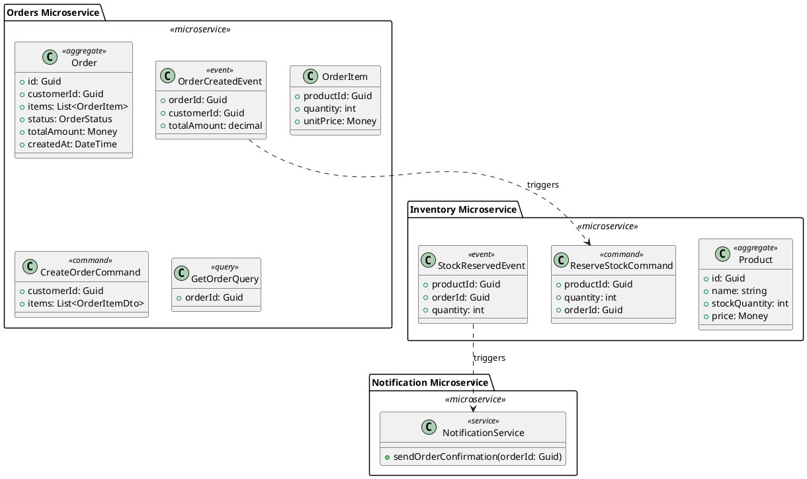

# Design 5: End-to-End Pipeline & Extensibility Framework

## Overview

This design defines the complete end-to-end pipeline for generating comprehensive n-tier solutions from PlantUML diagrams. It covers the full workflow from input to deployment-ready output, including message-based microservices architecture and extensibility mechanisms.

## Goals

1. Define the complete generation pipeline
2. Support message-based microservices architecture
3. Enable plugin/extension system for custom generators
4. Provide validation and error recovery
5. Support incremental generation and updates
6. Enable CI/CD integration

## End-to-End Pipeline Architecture

```
┌─────────────────────────────────────────────────────────────────────────────┐
│                          INPUT STAGE                                         │
├─────────────────────────────────────────────────────────────────────────────┤
│  ┌────────────┐  ┌────────────┐  ┌────────────┐  ┌────────────┐            │
│  │  PlantUML  │  │   Config   │  │  Template  │  │  Existing  │            │
│  │   Files    │  │   JSON     │  │   Presets  │  │  Solution  │            │
│  └─────┬──────┘  └─────┬──────┘  └─────┬──────┘  └─────┬──────┘            │
│        │               │               │               │                    │
│        └───────────────┴───────────────┴───────────────┘                    │
│                                  │                                           │
│                                  ▼                                           │
│                     ┌────────────────────────┐                              │
│                     │    Input Aggregator    │                              │
│                     └────────────────────────┘                              │
└─────────────────────────────────────────────────────────────────────────────┘
                                   │
                                   ▼
┌─────────────────────────────────────────────────────────────────────────────┐
│                         PARSING STAGE                                        │
├─────────────────────────────────────────────────────────────────────────────┤
│  ┌────────────────────────────────────────────────────────────────────┐     │
│  │                      PlantUML Parser Pipeline                       │     │
│  │  ┌──────────┐   ┌──────────┐   ┌──────────┐   ┌──────────┐        │     │
│  │  │  Lexer   │ → │  Parser  │ → │Validator │ → │ Resolver │        │     │
│  │  └──────────┘   └──────────┘   └──────────┘   └──────────┘        │     │
│  └────────────────────────────────────────────────────────────────────┘     │
│                                  │                                           │
│                                  ▼                                           │
│                     ┌────────────────────────┐                              │
│                     │    Semantic Model      │                              │
│                     └────────────────────────┘                              │
└─────────────────────────────────────────────────────────────────────────────┘
                                   │
                                   ▼
┌─────────────────────────────────────────────────────────────────────────────┐
│                        ANALYSIS STAGE                                        │
├─────────────────────────────────────────────────────────────────────────────┤
│  ┌──────────────────────────────────────────────────────────────────────┐   │
│  │                         Analyzers                                     │   │
│  │  ┌─────────────┐ ┌─────────────┐ ┌─────────────┐ ┌─────────────┐    │   │
│  │  │  Bounded    │ │  Aggregate  │ │  Message    │ │  Dependency │    │   │
│  │  │  Context    │ │  Detector   │ │  Flow       │ │  Graph      │    │   │
│  │  │  Analyzer   │ │             │ │  Analyzer   │ │  Builder    │    │   │
│  │  └─────────────┘ └─────────────┘ └─────────────┘ └─────────────┘    │   │
│  └──────────────────────────────────────────────────────────────────────┘   │
│                                  │                                           │
│                                  ▼                                           │
│                     ┌────────────────────────┐                              │
│                     │   Architecture Model   │                              │
│                     └────────────────────────┘                              │
└─────────────────────────────────────────────────────────────────────────────┘
                                   │
                                   ▼
┌─────────────────────────────────────────────────────────────────────────────┐
│                       TRANSFORMATION STAGE                                   │
├─────────────────────────────────────────────────────────────────────────────┤
│  ┌──────────────────────────────────────────────────────────────────────┐   │
│  │                        Transformers                                   │   │
│  │  ┌─────────────┐ ┌─────────────┐ ┌─────────────┐ ┌─────────────┐    │   │
│  │  │  Solution   │ │  Project    │ │   Entity    │ │   Message   │    │   │
│  │  │  Model      │ │  Model      │ │   Model     │ │   Model     │    │   │
│  │  │ Transformer │ │ Transformer │ │ Transformer │ │ Transformer │    │   │
│  │  └─────────────┘ └─────────────┘ └─────────────┘ └─────────────┘    │   │
│  └──────────────────────────────────────────────────────────────────────┘   │
│                                  │                                           │
│                                  ▼                                           │
│                     ┌────────────────────────┐                              │
│                     │    Generation Plan     │                              │
│                     └────────────────────────┘                              │
└─────────────────────────────────────────────────────────────────────────────┘
                                   │
                                   ▼
┌─────────────────────────────────────────────────────────────────────────────┐
│                        GENERATION STAGE                                      │
├─────────────────────────────────────────────────────────────────────────────┤
│  ┌──────────────────────────────────────────────────────────────────────┐   │
│  │                        Code Generators                                │   │
│  │  ┌─────────────┐ ┌─────────────┐ ┌─────────────┐ ┌─────────────┐    │   │
│  │  │  Solution   │ │  Project    │ │   File      │ │  Template   │    │   │
│  │  │  Generator  │ │  Generator  │ │  Generator  │ │  Processor  │    │   │
│  │  └─────────────┘ └─────────────┘ └─────────────┘ └─────────────┘    │   │
│  └──────────────────────────────────────────────────────────────────────┘   │
│                                  │                                           │
│                                  ▼                                           │
│                     ┌────────────────────────┐                              │
│                     │    File Artifacts      │                              │
│                     └────────────────────────┘                              │
└─────────────────────────────────────────────────────────────────────────────┘
                                   │
                                   ▼
┌─────────────────────────────────────────────────────────────────────────────┐
│                       POST-PROCESSING STAGE                                  │
├─────────────────────────────────────────────────────────────────────────────┤
│  ┌─────────────┐ ┌─────────────┐ ┌─────────────┐ ┌─────────────┐           │
│  │  Format     │ │  Package    │ │  Reference  │ │  Verify     │           │
│  │  Code       │ │  Install    │ │  Resolution │ │  Build      │           │
│  └─────────────┘ └─────────────┘ └─────────────┘ └─────────────┘           │
└─────────────────────────────────────────────────────────────────────────────┘
                                   │
                                   ▼
┌─────────────────────────────────────────────────────────────────────────────┐
│                          OUTPUT STAGE                                        │
├─────────────────────────────────────────────────────────────────────────────┤
│  ┌────────────┐  ┌────────────┐  ┌────────────┐  ┌────────────┐            │
│  │  Complete  │  │  Build     │  │  Docker    │  │  CI/CD     │            │
│  │  Solution  │  │  Scripts   │  │  Compose   │  │  Pipeline  │            │
│  └────────────┘  └────────────┘  └────────────┘  └────────────┘            │
└─────────────────────────────────────────────────────────────────────────────┘
```

## Message-Based Microservices Architecture

### PlantUML Input for Microservices



### Microservice Model

```csharp
namespace Endpoint.PlantUml.Models.Microservices
{
    public class MicroservicesSolutionModel
    {
        public string SolutionName { get; set; }
        public List<MicroserviceModel> Microservices { get; set; } = new();
        public List<MessageFlowModel> MessageFlows { get; set; } = new();
        public SharedKernelModel SharedKernel { get; set; }
        public GatewayModel ApiGateway { get; set; }
        public MessagingConfiguration Messaging { get; set; }
        public AspireConfiguration Aspire { get; set; }
    }

    public class MicroserviceModel
    {
        public string Name { get; set; }
        public string BoundedContext { get; set; }
        public List<AggregateModel> Aggregates { get; set; } = new();
        public List<CommandModel> Commands { get; set; } = new();
        public List<QueryModel> Queries { get; set; } = new();
        public List<EventModel> Events { get; set; } = new();
        public List<MessageHandlerModel> MessageHandlers { get; set; } = new();
        public List<ServiceInterfaceModel> Services { get; set; } = new();
        public DatabaseConfiguration Database { get; set; }
        public List<string> Dependencies { get; set; } = new();
    }

    public class MessageFlowModel
    {
        public string SourceService { get; set; }
        public string SourceEvent { get; set; }
        public string TargetService { get; set; }
        public string TargetHandler { get; set; }
        public MessageFlowType FlowType { get; set; }
    }

    public enum MessageFlowType
    {
        Event,
        Command,
        Query
    }

    public class EventModel
    {
        public string Name { get; set; }
        public string AggregateType { get; set; }
        public List<PropertyModel> Properties { get; set; } = new();
        public List<string> TriggersCommands { get; set; } = new();
    }

    public class MessageHandlerModel
    {
        public string Name { get; set; }
        public string MessageType { get; set; }
        public MessageHandlerType HandlerType { get; set; }
        public string ReturnType { get; set; }
    }

    public enum MessageHandlerType
    {
        CommandHandler,
        EventHandler,
        QueryHandler,
        Saga
    }
}
```

### Generated Microservice Structure

```
ECommerce/
├── src/
│   ├── ECommerce.AppHost/                      # Aspire orchestration
│   │   └── Program.cs
│   │
│   ├── ECommerce.ServiceDefaults/              # Shared Aspire defaults
│   │
│   ├── ECommerce.SharedKernel/                 # Shared contracts
│   │   ├── Events/
│   │   │   ├── OrderCreatedEvent.cs
│   │   │   └── StockReservedEvent.cs
│   │   ├── Commands/
│   │   │   ├── CreateOrderCommand.cs
│   │   │   └── ReserveStockCommand.cs
│   │   ├── Queries/
│   │   │   └── GetOrderQuery.cs
│   │   └── Common/
│   │       ├── IMessage.cs
│   │       ├── ICommand.cs
│   │       ├── IQuery.cs
│   │       └── IEvent.cs
│   │
│   ├── Services/
│   │   ├── Orders/
│   │   │   ├── ECommerce.Orders.Domain/
│   │   │   │   ├── Aggregates/
│   │   │   │   │   └── Order.cs
│   │   │   │   ├── Entities/
│   │   │   │   │   └── OrderItem.cs
│   │   │   │   ├── ValueObjects/
│   │   │   │   │   └── Money.cs
│   │   │   │   └── Interfaces/
│   │   │   │       └── IOrderRepository.cs
│   │   │   │
│   │   │   ├── ECommerce.Orders.Application/
│   │   │   │   ├── Commands/
│   │   │   │   │   └── CreateOrder/
│   │   │   │   │       ├── CreateOrderHandler.cs
│   │   │   │   │       └── CreateOrderValidator.cs
│   │   │   │   ├── Queries/
│   │   │   │   │   └── GetOrder/
│   │   │   │   │       └── GetOrderHandler.cs
│   │   │   │   └── EventHandlers/
│   │   │   │       └── StockReservedHandler.cs
│   │   │   │
│   │   │   ├── ECommerce.Orders.Infrastructure/
│   │   │   │   ├── Persistence/
│   │   │   │   ├── Messaging/
│   │   │   │   │   └── RabbitMqEventPublisher.cs
│   │   │   │   └── Repositories/
│   │   │   │
│   │   │   └── ECommerce.Orders.Api/
│   │   │       ├── Program.cs
│   │   │       ├── Controllers/
│   │   │       └── Dockerfile
│   │   │
│   │   ├── Inventory/
│   │   │   ├── ECommerce.Inventory.Domain/
│   │   │   ├── ECommerce.Inventory.Application/
│   │   │   ├── ECommerce.Inventory.Infrastructure/
│   │   │   └── ECommerce.Inventory.Api/
│   │   │
│   │   └── Notifications/
│   │       └── ECommerce.Notifications.Worker/
│   │
│   ├── Gateway/
│   │   └── ECommerce.ApiGateway/               # YARP or Ocelot
│   │
│   └── Frontend/
│       └── ECommerce.Angular/
│
├── docker-compose.yml
├── docker-compose.override.yml
└── ECommerce.sln
```

## Extensibility Framework

### Plugin System

```csharp
namespace Endpoint.PlantUml.Extensibility
{
    /// <summary>
    /// Interface for generator plugins
    /// </summary>
    public interface IGeneratorPlugin
    {
        string Name { get; }
        string Description { get; }
        int Priority { get; }
        bool CanHandle(GenerationContext context);
        Task<GenerationResult> GenerateAsync(GenerationContext context, CancellationToken ct);
    }

    /// <summary>
    /// Interface for analyzer plugins
    /// </summary>
    public interface IAnalyzerPlugin
    {
        string Name { get; }
        Task<AnalysisResult> AnalyzeAsync(PlantUmlDocument document, CancellationToken ct);
    }

    /// <summary>
    /// Interface for transformer plugins
    /// </summary>
    public interface ITransformerPlugin
    {
        string Name { get; }
        Type InputType { get; }
        Type OutputType { get; }
        Task<object> TransformAsync(object input, TransformationContext context, CancellationToken ct);
    }

    /// <summary>
    /// Plugin loader and registry
    /// </summary>
    public interface IPluginRegistry
    {
        void RegisterPlugin<T>(T plugin) where T : class;
        IEnumerable<T> GetPlugins<T>() where T : class;
        void LoadPluginsFromDirectory(string directory);
        void LoadPluginsFromAssembly(Assembly assembly);
    }

    public class PluginRegistry : IPluginRegistry
    {
        private readonly Dictionary<Type, List<object>> _plugins = new();
        private readonly IServiceProvider _serviceProvider;

        public void LoadPluginsFromDirectory(string directory)
        {
            foreach (var dll in Directory.GetFiles(directory, "*.dll"))
            {
                try
                {
                    var assembly = Assembly.LoadFrom(dll);
                    LoadPluginsFromAssembly(assembly);
                }
                catch (Exception ex)
                {
                    // Log warning but continue
                }
            }
        }

        public void LoadPluginsFromAssembly(Assembly assembly)
        {
            var pluginTypes = assembly.GetTypes()
                .Where(t => !t.IsAbstract && t.GetInterfaces()
                    .Any(i => i.Name.EndsWith("Plugin")));

            foreach (var type in pluginTypes)
            {
                var plugin = ActivatorUtilities.CreateInstance(_serviceProvider, type);
                RegisterPluginInternal(plugin);
            }
        }
    }
}
```

### Custom Generator Example

```csharp
namespace MyCompany.Endpoint.Plugins
{
    /// <summary>
    /// Custom generator plugin for company-specific patterns
    /// </summary>
    public class CompanySpecificGeneratorPlugin : IGeneratorPlugin
    {
        public string Name => "CompanySpecific";
        public string Description => "Generates company-specific boilerplate and patterns";
        public int Priority => 100;

        public bool CanHandle(GenerationContext context)
        {
            return context.Options.CustomOptions.ContainsKey("company-specific");
        }

        public async Task<GenerationResult> GenerateAsync(GenerationContext context, CancellationToken ct)
        {
            var result = new GenerationResult();

            // Add company-specific files
            result.Files.Add(new GeneratedFile
            {
                Path = "src/Common/CompanyExtensions.cs",
                Content = GenerateCompanyExtensions(context)
            });

            result.Files.Add(new GeneratedFile
            {
                Path = "src/Common/AuditableEntity.cs",
                Content = GenerateAuditableEntity(context)
            });

            return result;
        }
    }
}
```

### Pipeline Configuration

```csharp
namespace Endpoint.PlantUml.Pipeline
{
    public class GenerationPipelineConfiguration
    {
        public List<PipelineStageConfiguration> Stages { get; set; } = new();
        public Dictionary<string, object> GlobalOptions { get; set; } = new();
        public List<string> EnabledPlugins { get; set; } = new();
        public List<string> DisabledPlugins { get; set; } = new();
    }

    public class PipelineStageConfiguration
    {
        public string Name { get; set; }
        public bool Enabled { get; set; } = true;
        public int Order { get; set; }
        public Dictionary<string, object> Options { get; set; } = new();
        public List<string> Plugins { get; set; } = new();
    }

    public interface IGenerationPipeline
    {
        Task<GenerationResult> ExecuteAsync(GenerationRequest request, CancellationToken ct);
        void AddStage(IPipelineStage stage);
        void InsertStage(int index, IPipelineStage stage);
        void RemoveStage(string stageName);
    }

    public interface IPipelineStage
    {
        string Name { get; }
        int Order { get; }
        Task<PipelineContext> ExecuteAsync(PipelineContext context, CancellationToken ct);
    }

    public class PipelineContext
    {
        public GenerationRequest Request { get; set; }
        public PlantUmlDocument Document { get; set; }
        public SemanticModel SemanticModel { get; set; }
        public ArchitectureModel ArchitectureModel { get; set; }
        public GenerationPlan Plan { get; set; }
        public List<GeneratedFile> Files { get; set; } = new();
        public List<DiagnosticMessage> Diagnostics { get; set; } = new();
        public Dictionary<string, object> State { get; set; } = new();
    }
}
```

## Comprehensive Command Interface

```csharp
namespace Endpoint.Cli.Commands
{
    [Verb("create-solution-from-plantuml", HelpText = "Create a complete n-tier solution from PlantUML diagram")]
    public class CreateSolutionFromPlantUmlRequest : IRequest
    {
        // Input options
        [Option('f', "file", Required = true, HelpText = "Path to PlantUML file(s)")]
        public IEnumerable<string> Files { get; set; }

        [Option('c', "config", HelpText = "Path to configuration JSON file")]
        public string ConfigFile { get; set; }

        // Output options
        [Option('n', "name", Required = true, HelpText = "Solution name")]
        public string SolutionName { get; set; }

        [Option('o', "output", HelpText = "Output directory")]
        public string OutputDirectory { get; set; } = Environment.CurrentDirectory;

        // Architecture options
        [Option('t', "template", Default = "CleanArchitecture",
            HelpText = "Solution template (CleanArchitecture, VerticalSlice, Modular, Microservices)")]
        public string Template { get; set; }

        [Option("aspire", HelpText = "Use .NET Aspire orchestration")]
        public bool UseAspire { get; set; }

        [Option("microservices", HelpText = "Generate microservices architecture")]
        public bool UseMicroservices { get; set; }

        // Database options
        [Option("database", Default = "SqlServer",
            HelpText = "Database provider (SqlServer, PostgreSql, MySql, Sqlite, CosmosDb)")]
        public string DatabaseProvider { get; set; }

        // Messaging options
        [Option("messaging", Default = "None",
            HelpText = "Messaging provider (None, RabbitMq, AzureServiceBus, Kafka)")]
        public string MessagingProvider { get; set; }

        // Caching options
        [Option("cache", Default = "None",
            HelpText = "Cache provider (None, Redis, Memory)")]
        public string CacheProvider { get; set; }

        // Frontend options
        [Option("angular", HelpText = "Include Angular frontend")]
        public bool IncludeAngular { get; set; }

        [Option("angular-state", Default = "ngrx",
            HelpText = "Angular state management (ngrx, component-store, signals)")]
        public string AngularStateManagement { get; set; }

        // Additional options
        [Option("docker", HelpText = "Include Docker configuration")]
        public bool IncludeDocker { get; set; }

        [Option("tests", Default = true, HelpText = "Include test projects")]
        public bool IncludeTests { get; set; }

        [Option("ci", HelpText = "Include CI/CD configuration (github, azure-devops)")]
        public string CiProvider { get; set; }

        [Option("dry-run", HelpText = "Preview generated files without writing")]
        public bool DryRun { get; set; }

        [Option("verbose", HelpText = "Verbose output")]
        public bool Verbose { get; set; }
    }

    public class CreateSolutionFromPlantUmlRequestHandler : IRequestHandler<CreateSolutionFromPlantUmlRequest>
    {
        private readonly IGenerationPipeline _pipeline;
        private readonly IPluginRegistry _pluginRegistry;
        private readonly ILogger<CreateSolutionFromPlantUmlRequestHandler> _logger;

        public async Task Handle(CreateSolutionFromPlantUmlRequest request, CancellationToken ct)
        {
            // Load configuration
            var config = await LoadConfigurationAsync(request, ct);

            // Build generation request
            var generationRequest = new GenerationRequest
            {
                PlantUmlFiles = request.Files.ToList(),
                SolutionName = request.SolutionName,
                OutputDirectory = request.OutputDirectory,
                Options = MapRequestToOptions(request, config)
            };

            // Execute pipeline
            var result = await _pipeline.ExecuteAsync(generationRequest, ct);

            // Handle results
            if (result.Diagnostics.Any(d => d.Severity == Severity.Error))
            {
                foreach (var error in result.Diagnostics.Where(d => d.Severity == Severity.Error))
                {
                    _logger.LogError("{Code}: {Message}", error.Code, error.Message);
                }
                throw new GenerationException("Generation failed with errors");
            }

            // Output results
            if (request.DryRun)
            {
                PrintDryRunResults(result);
            }
            else
            {
                await WriteResultsAsync(result, ct);
                PrintSummary(result);
            }
        }
    }
}
```

## Configuration File Schema

```json
{
  "$schema": "https://json-schema.org/draft/2020-12/schema",
  "title": "PlantUML Solution Configuration",
  "type": "object",
  "properties": {
    "solutionName": {
      "type": "string",
      "description": "Name of the generated solution"
    },
    "template": {
      "type": "string",
      "enum": ["CleanArchitecture", "VerticalSlice", "Modular", "Microservices"],
      "default": "CleanArchitecture"
    },
    "aspire": {
      "type": "object",
      "properties": {
        "enabled": { "type": "boolean", "default": false },
        "dashboard": { "type": "boolean", "default": true }
      }
    },
    "database": {
      "type": "object",
      "properties": {
        "provider": {
          "type": "string",
          "enum": ["SqlServer", "PostgreSql", "MySql", "Sqlite", "CosmosDb"],
          "default": "SqlServer"
        },
        "connectionStringName": { "type": "string", "default": "DefaultConnection" },
        "migrations": { "type": "boolean", "default": true }
      }
    },
    "messaging": {
      "type": "object",
      "properties": {
        "provider": {
          "type": "string",
          "enum": ["None", "RabbitMq", "AzureServiceBus", "Kafka"],
          "default": "None"
        },
        "queues": {
          "type": "array",
          "items": { "type": "string" }
        },
        "topics": {
          "type": "array",
          "items": { "type": "string" }
        }
      }
    },
    "caching": {
      "type": "object",
      "properties": {
        "provider": {
          "type": "string",
          "enum": ["None", "Redis", "Memory"],
          "default": "None"
        }
      }
    },
    "angular": {
      "type": "object",
      "properties": {
        "enabled": { "type": "boolean", "default": false },
        "version": { "type": "string", "default": "17" },
        "stateManagement": {
          "type": "string",
          "enum": ["ngrx", "component-store", "signals"],
          "default": "ngrx"
        },
        "standalone": { "type": "boolean", "default": true }
      }
    },
    "testing": {
      "type": "object",
      "properties": {
        "unit": { "type": "boolean", "default": true },
        "integration": { "type": "boolean", "default": true },
        "architecture": { "type": "boolean", "default": false },
        "framework": {
          "type": "string",
          "enum": ["xUnit", "NUnit", "MSTest"],
          "default": "xUnit"
        }
      }
    },
    "docker": {
      "type": "object",
      "properties": {
        "enabled": { "type": "boolean", "default": false },
        "compose": { "type": "boolean", "default": true },
        "kubernetes": { "type": "boolean", "default": false }
      }
    },
    "ci": {
      "type": "object",
      "properties": {
        "provider": {
          "type": "string",
          "enum": ["None", "github", "azure-devops", "gitlab"],
          "default": "None"
        }
      }
    },
    "customPackages": {
      "type": "array",
      "items": {
        "type": "object",
        "properties": {
          "project": { "type": "string" },
          "packages": {
            "type": "array",
            "items": { "type": "string" }
          }
        }
      }
    },
    "plugins": {
      "type": "array",
      "items": { "type": "string" }
    }
  }
}
```

## CI/CD Integration

### GitHub Actions Workflow Generation

```yaml
# .github/workflows/ci.yml
name: CI/CD Pipeline

on:
  push:
    branches: [main, develop]
  pull_request:
    branches: [main]

jobs:
  build:
    runs-on: ubuntu-latest
    steps:
      - uses: actions/checkout@v4

      - name: Setup .NET
        uses: actions/setup-dotnet@v4
        with:
          dotnet-version: '9.0.x'

      - name: Restore dependencies
        run: dotnet restore

      - name: Build
        run: dotnet build --no-restore

      - name: Test
        run: dotnet test --no-build --verbosity normal

  docker:
    needs: build
    runs-on: ubuntu-latest
    if: github.ref == 'refs/heads/main'
    steps:
      - uses: actions/checkout@v4

      - name: Build and push Docker images
        run: |
          docker compose build
          docker compose push
```

## Validation Rules

```csharp
namespace Endpoint.PlantUml.Validation
{
    public class ValidationRuleSet
    {
        public static IEnumerable<IValidationRule> GetDefaultRules()
        {
            yield return new AggregateHasIdentityRule();
            yield return new CommandHasHandlerRule();
            yield return new QueryHasHandlerRule();
            yield return new EventHasSubscriberRule();
            yield return new CircularDependencyRule();
            yield return new BoundedContextBoundaryRule();
            yield return new NamingConventionRule();
            yield return new StereotypeValidationRule();
        }
    }

    public interface IValidationRule
    {
        string Code { get; }
        string Description { get; }
        Severity DefaultSeverity { get; }
        IEnumerable<DiagnosticMessage> Validate(SemanticModel model);
    }

    public class AggregateHasIdentityRule : IValidationRule
    {
        public string Code => "PUML001";
        public string Description => "Aggregate roots must have an identity property";
        public Severity DefaultSeverity => Severity.Error;

        public IEnumerable<DiagnosticMessage> Validate(SemanticModel model)
        {
            foreach (var aggregate in model.Aggregates)
            {
                if (!aggregate.Properties.Any(p =>
                    p.Name.Equals("Id", StringComparison.OrdinalIgnoreCase) ||
                    p.Name.EndsWith("Id", StringComparison.OrdinalIgnoreCase)))
                {
                    yield return new DiagnosticMessage
                    {
                        Code = Code,
                        Message = $"Aggregate '{aggregate.Name}' does not have an identity property",
                        Severity = DefaultSeverity,
                        Suggestions = new[] { "Add a property named 'Id' or '{AggregateName}Id'" }
                    };
                }
            }
        }
    }
}
```

## Summary

This design provides:

1. **Complete Pipeline**: From PlantUML input to deployment-ready solution
2. **Microservices Support**: Full message-based architecture generation
3. **Extensibility**: Plugin system for custom generators and analyzers
4. **Validation**: Comprehensive validation rules with helpful diagnostics
5. **CI/CD Integration**: Automated pipeline generation
6. **Configuration**: Flexible JSON-based configuration
